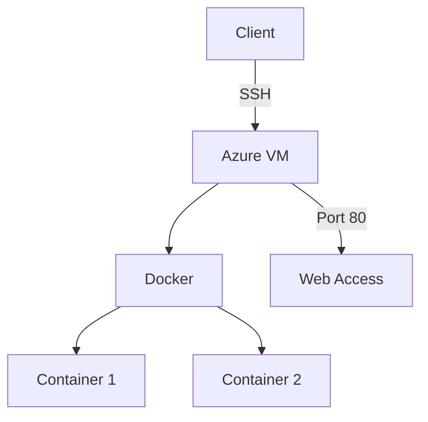

# Cloud-init

## Tutoriel: Déploiement d'une VM Azure avec Docker via cloud-init

Ce guide vous accompagne, étape par étape, dans le déploiement d'une machine virtuelle Ubuntu sur Azure, configurée automatiquement avec Docker et Docker Compose.

***


### Table des Matières

1. Préparer le fichier cloud-init YAML
2. Préparer vos clés SSH
3. Choisir l’abonnement par défaut Azure
4. Créer un groupe de ressources
5. Créer et configurer la VM
6. Ouvrir les ports nécessaires (HTTP, HTTPS, SSH)
7. Obtenir l’adresse IP publique de la VM
8. Connexion SSH à la VM
9. Vérification de l’installation sur la VM
10. Scripts pour gérer la VM

***

### Prérequis

* Compte Azure actif
* Azure CLI installé
* Accès en ligne de commande
* Connaissance basique de Docker

***

### Étape 1 : Préparer le fichier cloud-init YAML

```

\#cloud-config
package_update: true
package_upgrade: true
packages:

- docker.io
- docker-compose
...

```

Ce fichier `cloud-init.yml` permet de :

* Mettre à jour le système
* Installer Docker et Docker Compose
* Ajouter l’utilisateur par défaut au groupe docker
* Copier votre fichier Docker Compose
* Lancer les services définis

***

### Étape 2 : Préparer vos clés SSH

#### Chemin des clés sur Linux

```

~/.ssh/id_rsa

```

Clé privée.

```

~/.ssh/id_rsa.pub

```

Clé publique.

#### Vérifier la présence de vos clés

```

ls -la ~/.ssh/

```

Permet de vérifier si vous avez déjà une clé SSH.

#### Générer une clé SSH (si nécessaire)

```

ssh-keygen -t rsa -b 4096

```

Pour générer une nouvelle clé RSA.

***

### Étape 3 : Choisir l’abonnement par défaut Azure

```

az account list --output table

```

Liste les abonnements disponibles.

```

az account set --subscription "<Nom-Ou-ID-de-l-abonnement>"

```

Sélectionne l’abonnement à utiliser.

***

### Étape 4 : Créer un groupe de ressources

```

az group create --name rg-cr465gamespace-<votre-matricule> --location canadacentral

```

Crée un espace de travail (groupe de ressources) dans Azure. Remplacez `<votre-matricule>` par votre numéro personnel.

***

### Étape 5 : Créer et configurer la VM

Images disponibles :

* Ubuntu2204
* Ubuntu2404
* Ubuntu2404Pro
* Debian11

```

az vm create \
--resource-group rg-cr465gamespace-<votre-matricule> \
--name ubuntuDockerVM \
--image <UbuntuLTS> \
--admin-username azureuser \
--size Standard_B1s \
--custom-data cloud-init.yml \
--ssh-key-values <path-to-your-public-key> --debug

```

Crée une VM Ubuntu sur Azure, personnalisée via cloud-init. Remplacez `<votre-matricule>`, `<UbuntuLTS>`, et `<path-to-your-public-key>` selon votre contexte.

***

### Étape 6 : Ouvrir les ports nécessaires (HTTP, HTTPS, SSH)

```

az vm open-port --port 80 --resource-group rg-cr465gamespace-<votre-matricule> --name ubuntuDockerVM --priority 100

```

Ouvre le port HTTP (80).

```

az vm open-port --port 443 --resource-group rg-cr465gamespace-<votre-matricule> --name ubuntuDockerVM --priority 200

```

Ouvre le port HTTPS (443).

```

az vm open-port --port 22 --resource-group rg-cr465gamespace-<votre-matricule> --name ubuntuDockerVM --priority 300

```

Ouvre le port SSH (22).

***

### Étape 7 : Obtenir l’adresse IP publique de la VM

```

az vm show --resource-group rg-cr465gamespace-<votre-matricule> --name ubuntuDockerVM -d --query publicIps -o tsv

```

Récupère l'adresse IP publique pour vous connecter à votre VM.

***

### Étape 8 : Connexion SSH à la VM

```

ssh azureuser@<public-ip>

```

Connexion à la VM (remplacez `<public-ip>` par l’adresse obtenue à l’étape précédente).

***

### Étape 9 : Vérification de l’installation sur la VM

```

sudo cloud-init status --long

```

Vérifie le statut détaillé de cloud-init.

```

sudo cloud-init schema --system

```

Contrôle la validité du schéma cloud-init.

```

sudo tail -n 200 /var/log/cloud-init.log /var/log/cloud-init-output.log

```

Affiche les derniers logs cloud-init.

```

sudo tail -n 200 /var/log/apt/term.log /var/log/apt/history.log

```

Affiche l’historique des installations de paquets.

***

### Étape 10 : Scripts pour gérer la VM

```

./reCreateVM.sh <votre-matricule> <VM-NAME> <CONTAINER_TECH>-cloud-init.yml

```

Pour réinitialiser la VM rapidement (remplacez les valeurs !).

```

./deleteVM.sh <votre-matricule> <VM-NAME>

```

Pour supprimer complètement la VM.

***

### Récapitulatif des étapes

1. Créer le fichier cloud-init.yml
2. Générer ou vérifier les clés SSH
3. Sélectionner l’abonnement Azure
4. Créer un groupe de ressources Azure
5. Déployer la VM
6. Ouvrir les ports nécessaires
7. Obtenir l’IP et se connecter en SSH
8. Vérifier l'installation avec cloud-init
9. Gérer la VM avec les scripts fournis

***

### Dépannage

* Vérifiez que l’abonnement Azure est actif.
* Assurez-vous d’utiliser la bonne clé SSH.
* Examinez les logs cloud-init si un service ne démarre pas.

***

### Bonnes Pratiques de Sécurité

* Utilisation de groupes de sécurité réseau (NSG)
* Rotation régulière des clés SSH
* Mise à jour régulière des conteneurs Docker

### Versions Compatibles

* Azure CLI: 2.x
* Docker: 20.x+
* Ubuntu: 22.04, 24.04

### Architecture

